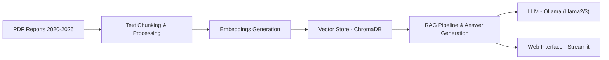

# 🏦 World Bank RAG QA System

A sophisticated Retrieval-Augmented Generation (RAG) system that provides intelligent question-answering capabilities for World Bank Development Reports using advanced vector search and AI-powered response generation.

## 🎯 Overview

This system transforms static World Bank Development Reports into an interactive knowledge base, allowing users to ask natural language questions and receive accurate, context-aware answers with proper citations. It combines modern embedding techniques, vector databases, and large language models to create a powerful research assistant.

## 🏗️ Architecture



## 📊 Dataset

### Source Documents
- **World Development Report 2020**: Trading for Development in the Age of Global Value Chains
- **World Development Report 2021**: Data, Digitalization, and Development
- **World Development Report 2022**: Finance for an Equitable Recovery
- **World Development Report 2023**: Migrants, Refugees, and Societies
- **World Development Report 2024**: The Middle Income Trap
- **World Development Report 2025**: Reimagining Development

### Data Processing Pipeline

1. **PDF Ingestion**: Using `pdfplumber` for accurate text extraction
2. **Text Chunking**: 
   - Intelligent chunking based on semantic boundaries
   - Chunk size: ~1000 characters with overlap
   - Preserves context and maintains readability
3. **Metadata Extraction**:
   - Document filename and page numbers
   - Character and token counts
   - Chunk indexing for precise citation

### Embedding Generation
- **Model**: `all-MiniLM-L6-v2` (SentenceTransformers)
- **Dimensions**: 384-dimensional vectors
- **Technique**: Semantic embeddings capturing contextual meaning
- **Total Chunks**: 3,010 document fragments

## 🗄️ Database Technology

### ChromaDB Vector Store
- **Type**: Persistent vector database
- **Storage**: Local file system (`vector_store/chroma_db/`)
- **Similarity Search**: Cosine similarity for semantic matching
- **Metadata Support**: Rich metadata for filtering and citation
- **Scalability**: Handles thousands of document chunks efficiently

### Search Strategy
- **Query Processing**: Natural language → embedding vector
- **Retrieval**: Top-k most similar chunks (default k=5)
- **Similarity Scoring**: Normalized cosine similarity (0-1)
- **Context Assembly**: Retrieved chunks formatted for LLM consumption

## 🤖 AI Integration

### Large Language Model
- **Backend**: Ollama (local LLM serving)
- **Models**: Llama2, Llama3, and other compatible models
- **Settings**: Temperature=0.1, max_tokens=1000
- **Prompt Engineering**: Structured prompts for consistent, accurate responses

### Answer Generation Pipeline
1. **Query Understanding**: Parse user intent
2. **Document Retrieval**: Find relevant chunks
3. **Context Assembly**: Format retrieved information
4. **LLM Generation**: Generate contextualized response
5. **Quality Assessment**: Evaluate answer relevance and completeness

## 🚀 Installation & Setup

### Prerequisites
- Python 3.8 or higher
- Ollama installed and running
- Git (for cloning)

### Step 1: Clone Repository
```bash
git clone https://github.com/Rezaul33/worldbank-rag-qa.git
cd worldbank-rag-qa
```

### Step 2: Install Python Dependencies
```bash
pip install -r requirements.txt
```

### Step 3: Install and Start Ollama
```bash
# Install Ollama (if not already installed)
# Visit: https://ollama.ai/

# Start Ollama server
ollama serve

# Pull a model (in another terminal)
ollama pull llama2
# or
ollama pull llama3
```

### Step 4: Verify Installation
```bash
# Test Ollama connection
python test_ollama_connection.py

# Test RAG pipeline
python test_rag_simple.py
```

## 🖥️ Usage

### Starting the Web Interface
```bash
# Option 1: Using the runner script (recommended)
python app/run_streamlit.py

# Option 2: Direct Streamlit launch
streamlit run app/streamlit_app.py
```

### Using the System
1. **Open Browser**: Navigate to `http://localhost:8501`
2. **Select Model**: Choose your preferred Ollama model in the sidebar
3. **Ask Questions**: Type questions in natural language
4. **View Results**: Get answers with source citations and similarity scores

### Example Queries
- "What are the main challenges in global development?"
- "How does climate change affect developing countries?"
- "What are the recommendations for economic growth?"
- "How do global value chains impact development?"

## 📁 Project Structure

```
worldbank-rag-qa/
├── app/                          # Streamlit web interface
│   ├── streamlit_app.py          # Main web application
│   └── run_streamlit.py          # Runner with error handling
├── chunking/                     # Text processing modules
│   └── text_chunker.py           # Document chunking logic
├── embeddings/                   # Embedding generation
│   └── embedding_generator.py    # Sentence transformer wrapper
├── evaluation/                   # Performance metrics
│   └── metrics.py                # RAG evaluation functions
├── generator/                    # Answer generation
│   └── answer_generator.py       # LLM response generation
├── ingestion/                    # Data ingestion
│   └── pdf_ingestion.py          # PDF processing pipeline
├── retriever/                    # RAG retrieval logic
│   └── rag_retriever.py          # Main RAG implementation
├── vector_store/                 # Database operations
│   └── chroma_db.py              # ChromaDB wrapper
├── notebooks/                    # Jupyter notebooks
│   └── evaluation.ipynb          # Analysis and testing
├── data/                         # Data directory (gitignored)
│   └── world_bank_pdfs/          # Source PDFs
├── embeddings/                   # Embedding cache (gitignored)
├── vector_store/                 # Database storage (gitignored)
├── requirements.txt              # Python dependencies
├── .gitignore                    # Git ignore rules
├── LICENSE                       # MIT License
└── README.md                     # This file
```

## ⚙️ Configuration

### Environment Variables
Create a `.env` file (optional):
```env
OLLAMA_BASE_URL=http://localhost:11434
OLLAMA_MODEL=llama2
EMBEDDING_MODEL=all-MiniLM-L6-v2
CHROMA_PERSIST_DIR=vector_store/chroma_db
```

### Customization Options
- **Embedding Models**: Change in `EmbeddingGenerator` initialization
- **Chunking Strategy**: Modify `text_chunker.py` parameters
- **LLM Settings**: Adjust temperature, max_tokens in `rag_retriever.py`
- **Retrieval Parameters**: Tune top_k, similarity thresholds

## 🧪 Testing

### Available Test Scripts
```bash
# Test individual components
python test_ollama_connection.py      # Test LLM connection
python test_rag_simple.py             # Test basic RAG pipeline
python test_final_rag.py              # Test complete system
python test_streamlit_simple.py       # Test Streamlit interface
```

### Performance Benchmarks
- **Query Processing**: 2-5 seconds
- **Document Retrieval**: 1-3 seconds  
- **Answer Generation**: 5-30 seconds (depends on model)
- **Total Response Time**: 10-60 seconds

## 🔧 Troubleshooting

### Common Issues

**Ollama Connection Failed**
```bash
# Check if Ollama is running
curl http://localhost:11434/api/tags

# Restart Ollama
ollama serve
```

**Import Errors**
```bash
# Reinstall dependencies
pip install -r requirements.txt --force-reinstall
```

**Vector Database Issues**
```bash
# Clear and rebuild database
rm -rf vector_store/chroma_db
python vector_store/chroma_db.py
```

**Memory Issues**
- Reduce `top_k` parameter in retrieval
- Use smaller embedding models
- Increase system RAM

### Performance Optimization
- **GPU Acceleration**: Install GPU versions of PyTorch
- **Caching**: Enable embedding caching for repeated queries
- **Batch Processing**: Process multiple queries simultaneously
- **Model Selection**: Use smaller/faster models for quick responses

## 📈 Features

### Core Capabilities
- ✅ **Semantic Search**: Advanced similarity matching
- ✅ **Context-Aware Answers**: LLM-powered response generation
- ✅ **Source Citation**: Precise document and page references
- ✅ **Performance Metrics**: Real-time system monitoring
- ✅ **Interactive Interface**: Modern web-based UI
- ✅ **Quality Assessment**: Automated answer evaluation

### Advanced Features
- 🔄 **Multiple Models**: Support for various Ollama models
- 📊 **Analytics Dashboard**: Query performance and usage statistics
- 💾 **Chat History**: Persistent conversation storage
- 🎛️ **Configurable Parameters**: Customizable retrieval and generation settings
- 📱 **Responsive Design**: Works on desktop and mobile devices

## 🤝 Contributing

We welcome contributions! Please follow these steps:

1. **Fork** the repository
2. **Create** a feature branch: `git checkout -b feature-name`
3. **Commit** changes: `git commit -am 'Add feature'`
4. **Push** to branch: `git push origin feature-name`
5. **Submit** a pull request

### Development Guidelines
- Follow PEP 8 style guidelines
- Add tests for new features
- Update documentation
- Ensure all tests pass

## 📄 License

This project is licensed under the MIT License - see the [LICENSE](LICENSE) file for details.

## 🙏 Acknowledgments

- **World Bank** for providing the Development Reports
- **Ollama** for local LLM serving capabilities
- **ChromaDB** for efficient vector storage
- **SentenceTransformers** for high-quality embeddings
- **Streamlit** for the excellent web framework

## 📞 Support

For questions, issues, or suggestions:
- 🐛 **Bug Reports**: Open an issue on GitHub
- 💡 **Feature Requests**: Open an issue with the "enhancement" label
- 📧 **General Questions**: Use GitHub Discussions

---
